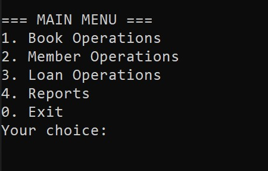
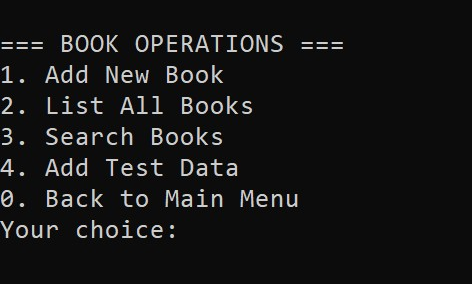
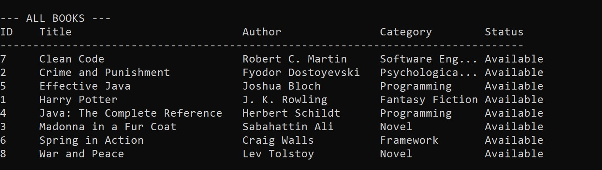
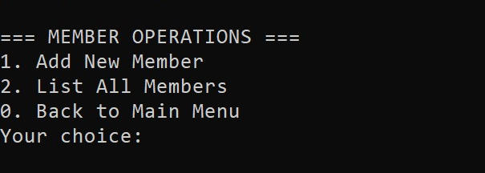
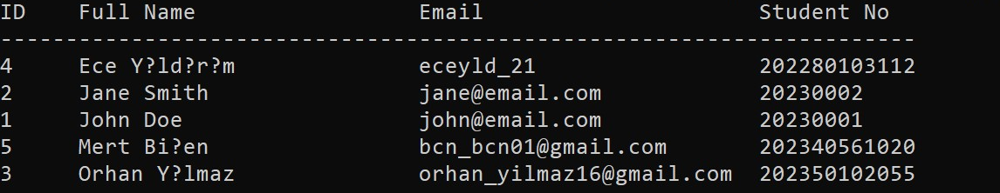

# Library Management System

A simple Java-based library management system using SQLite for persistent data storage.  
This project allows users to manage books, members, and loan operations via a console interface.

## Features

- Add, update, delete, and list books
- Add, update, delete, and list members
- Loan and return books
- Search books by title or author
- View reports (loan history, available books, etc.)
- Persistent data storage using SQLite database

## Technologies Used

- Java (OOP, layered architecture)
- SQLite (via JDBC)
- JDBC driver: [sqlite-jdbc](https://github.com/xerial/sqlite-jdbc)

## Project Structure

```
src/
  com/library/
    model/      # Data models (Book, User, Loan)
    dao/        # Database access objects
    service/    # Business logic
    ui/         # Console user interface
    util/       # Utility classes (Database connection)
lib/
  sqlite-jdbc-3.50.3.0.jar
database/
  library.db    # SQLite database file (created at runtime)
```

## How to Run

1. **Install Java JDK** (version 17 or higher recommended)
2. **Download sqlite-jdbc jar** and place it in the `lib/` folder
3. **Compile the project:**
   - Windows (PowerShell / CMD):
      ```
      dir /s /b src\*.java > sources.txt
      javac -d out -cp "lib/sqlite-jdbc-3.50.3.0.jar" @sources.txt
      ```
   - Linux / macOS (Bash / Zsh):
      ```
      find src -name "*.java" > sources.txt
      javac -d out -cp "lib/sqlite-jdbc-3.50.3.0.jar" @sources.txt
      ```
4. **Run the application:**
   - Windows:
      ```
      java -cp "out;lib/sqlite-jdbc-3.50.3.0.jar" com.library.ui.Main
      ```
   - Linux / macOS:
      ```
      java -cp "out:lib/sqlite-jdbc-3.50.3.0.jar" com.library.ui.Main
      ```
  

## Notes

- The database file (`library.db`) will be created automatically in the `database/` folder.
- For Windows users, you can create a `run.bat` file for easier startup.

## Screenshots

__
__
__
__
__


## License

This project is open source and free to use for educational purposes.